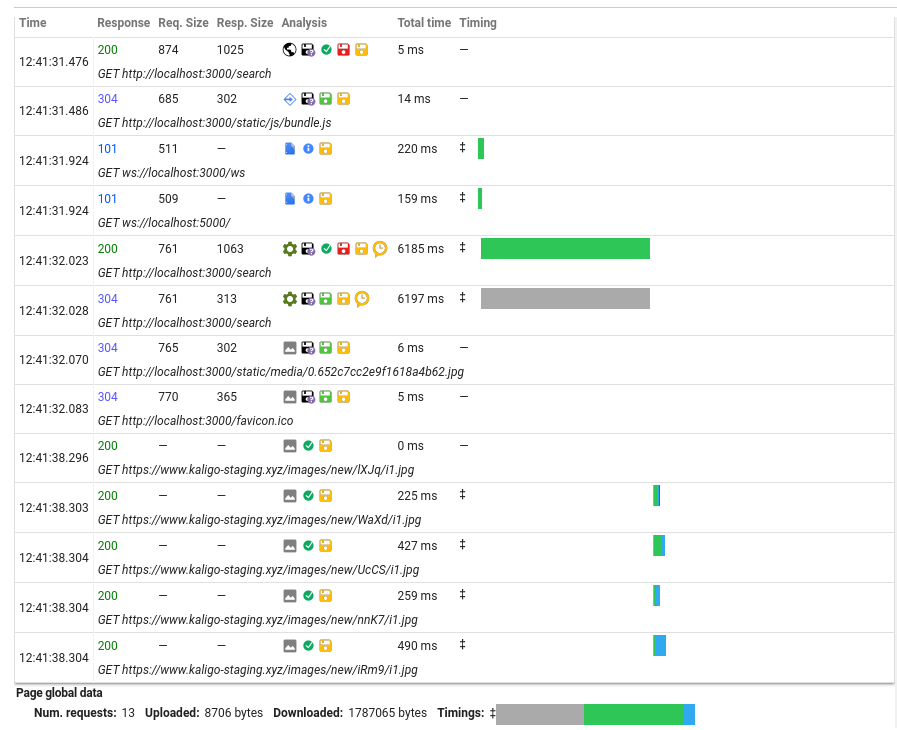
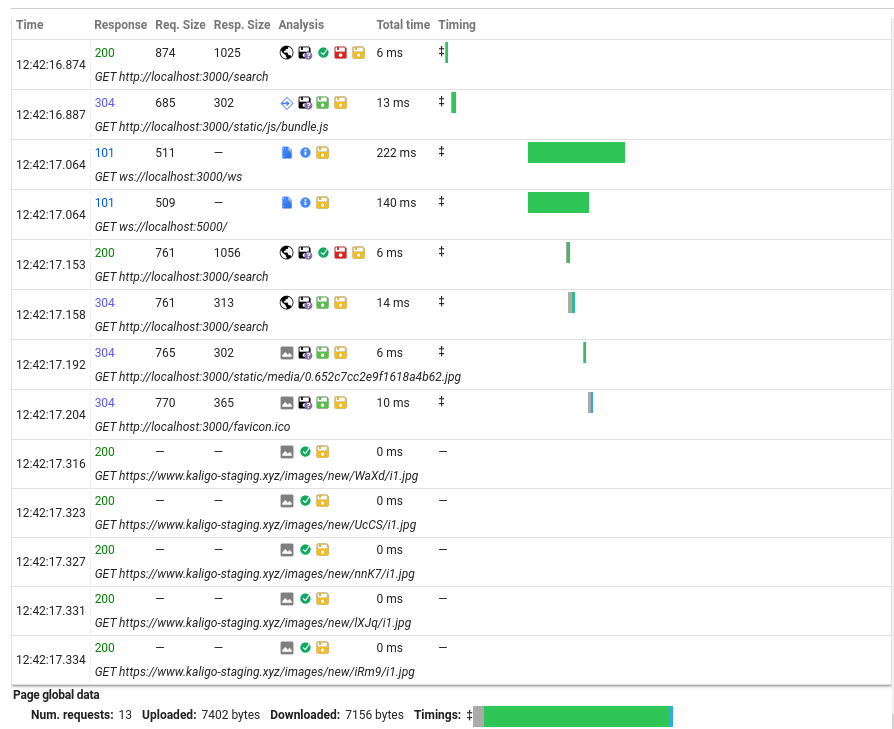

# ESC C2G6

## Start Project
### Start Server
nodemon:
```
npm run dev
```
start:
```
npm run start
```

### Start React
```
npm run start
```

## MongoDB Config
Sometimes MongoDB localhost is resolved to ::1 although IPv6 is not enabled.

If you get this error:```
connect ECONNREFUSED ::1:27017```, it means that MongoDB is trying resolving localhost as IPv6 address ```::1```, rather than ```127.0.0.1```. However, your IPv6 is disabled for MongoDB, and that's the reason you get this error message.

To prevent that from happening:
### Enable IPv6 for MongoDB
```
sudo nano /etc/mongodb.conf
```
```
# network interfaces:
net:
  port: 27017
  bindIp: ::1, 127.0.0.1 # ::1 is IPv6
  ipv6: true # enable IPv6
```
You can also use ```bindIpAll```. More detailed docs can be found at [MongoDB official docs](https://www.mongodb.com/docs/manual/reference/configuration-options/#net-options).

I suppose your local network config be like:
```
sudo nano /etc/hosts
```
```
127.0.0.1 localhost
::1 localhost
127.0.0.1 yourhostname
```

And I don't think it's appropriate to change ```/etc/hosts```.
## Register a user without using OTP
**UPDATE: You cannot use OTP from ```sprCatRoll@gmail.com``` now. Please register manually following the steps below.**
```
curl -X POST \
  http://localhost:5000/register \
  -H 'Content-Type: application/json' \
  -d '{
 "email": "me@example.com",
 "password": "000000"
}'
```
Then, go to mongodb ```auth/users```, and delete ```createdAt``` so that it will never expire.

Always use this email and OTP combination for login.

## Cancel booking
```
curl -X POST \
  http://localhost:5000/cancelBooking \
  -H 'Content-Type: application/json' \
  -d '{
 "bookingID": "_your_id_here"
}'
```

## OTP expiration time
```javascript
// Users.js
const UserSchema = new mongoose.Schema({
    /* Other code */
    createdAt: { type: Date, 
        expires: '3m', // expiration
        default: Date.now }
});
```
This is expected to change expected expiration time for users. For development, you can also delete ```createdAt``` as mentioned above.

## Login status (cookie) expiration time
```javascript
// auth.js
router.post('/authenticate', function (req, res) {
    /* Other code */
    User.findOne({email}, function (err, user) {
        if (err) {
            /* Other code */
        } else {
            user.isCorrectPassword(password, function (err, same) {
                if (err) {
                    /* Other code */
                } else {
                    /* Other code */
                    const token = jwt.sign(payload, secret, {
                        expiresIn: 60 * 3 * 2000 // expiration
                    });
                    /* Other code */
                }
            })
        }
    })
})
```

## Caching
### Usage
Server side caching is currently used for hotel search function. However, it is suitable for other GET requests as well.

Cache expiration time can be set when used.
```javascript
// server.js
import m_cache from "memory-cache";

const cache = (duration) => { // duration is in second here
    return (req, res, next) => {
        let key = '__express__' + req.originalUrl || req.url;
        let cachedBody = m_cache.get(key);
        if (cachedBody) {
            res.send(cachedBody);
            return;
        } else {
            res.sendResponse = res.send;
            res.send = (body) => {
                m_cache.put(key, body, duration * 1000); // * 1000 in ms
                res.sendResponse(body);
            }
            next();
        }
    }
};
```

```javascript
app.get("/yourAPI", cache(10), // in second
    async (req, res) => {
    // code implementation
})
```

### Improvement
This is a server side caching and the browser does not show cache control method. The server will memorise the result and return to frontend.



## Credentials exposure
 - [ ] OTP sender email & pwd
 - [ ] ```secret = "mySecret"```